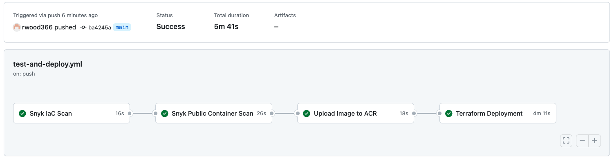
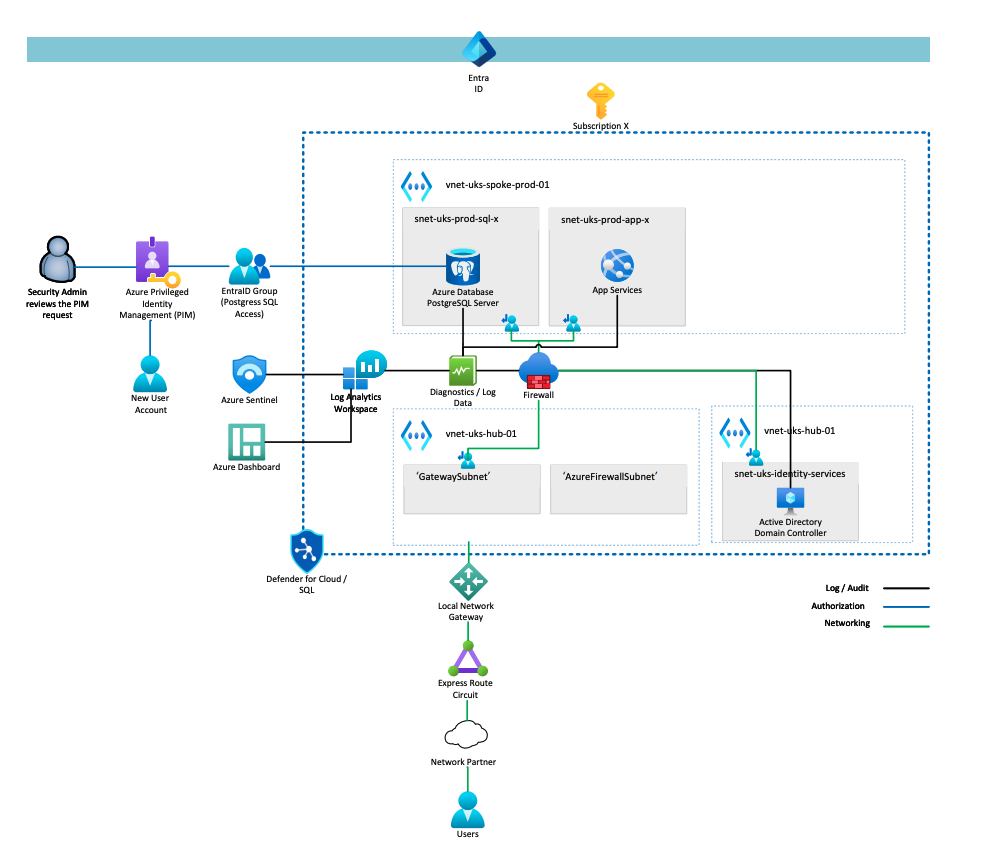

# CFP-Task

## Summary
A central CI/CD pipeline scans Terrafrom and container images for security vulnerabilities. If High or Critical issues are found, then the pipeline will terminate. Assuming no issues, a Postgres image is pulled from Docker Hub, tagged and automatically uploaded into a private Azure Container Registry (ACR). Finally, the image is pulled down from the ACR and deployed onto Azure Container Instances (ACI), along with a VNET / Subnet / Network Security Group (NSG). No further progress was made due to time restrictions.

## Tools Used
- Visual Studio Code (Free, Open Source, Many Plugins)
- Snyk (Supports scanning in IDE / Pipelines / Repo / Containers with good third party integrations and reporting).
- Github / Actions / Secrets (Industry standard version control, CI/CD and secure storage for sensitive info (e.g. API secrets)
- Terraform (Industry standard Infrastructure as Code language)
- Azure (I have more experience with Azure when compared with GCP / AWS)

## Assumptions
- You have an Azure tenancy with a subscription.
- You have a existing Azure Container registry configured with private networking (other registries would also work)
- You have Visual Studio Installed.

## Setup
1. Clone the repo locally.
2. Create a free Snyk account and generate an API token for your user account (https://snyk.io/).
3. Login to your Terraform Cloud account and generate an API token (https://app.terraform.io/app/).
4. Store both API tokens as Github Secrets with clear names (SNYK_API_TOKEN_DEMO / TF_API_TOKEN_DEMO).
5. Create an Azure Service Principal with Contributor permissions for the subscription: az ad sp create-for-rbac --name "<your-sp-name>" --role Contributor --scopes /subscriptions/<your-subscription-id>
6. Login to Terraform Cloud, create an API driven workspace and add the following PRIVATE workspace variables (ARM_CLIENT_ID, ARM_CLIENT_SECRET, ARM_SUBSCRIPTION_ID, ARM_TENANT_ID). Ensure the name of your ACR is also added (ARM_REGISTRY_NAME)
7.  Fill in the variables within the variables.tf file.
8.  Push to 'main' to start pipeline.
9.  Login to the Github portal to monitor progress / security results.

# P2 - CFP Energy - Secure Database Access (Scenario)

## Summary of Infrastructure
The following solution presents an end-to-end Windows architecture.

Most organizations operate a hybrid network between one or more cloud providers, as such I would implement Express Route (preferred) or Site to Site VPN from CFPs on-prem network / service provider into Azure to provide a private and secure connection.

The Postgres instance sits within a Virtual Network (VNET) and Subnet in Azure with full logging and auditing enabled. Traffic to and from the Subnet is inspected by a Firewall appliance to ensure only compliant traffic can pass freely. Logging and diagnostic data from resources (Postgres / Firewall / App Services) would be sent to an Azure Log Analytics Workspace (LAW) for storage. Other services can access this data for security and auditing purposes, e.g. Microsoft Sentinel / Azure Dashboard for visualisations. Retention periods would be set in the LAW to ensure data is consistently retained for the required period of time, e.g. 90 days.

The scenario dictates that user accounts will be created on an ‘as and when’ basis, with approval being required before access is granted. I would suggest accounts being created in Active Directory (AD) with Entra ID Connect being used to sync accounts upto Entra ID. From there, Azure Privileged Identity Management (PIM) can be used to gain approval from security admins via an email notification and approval flow. Once the request is approved, the user account can be added to the Entra ID group which has been assigned permission in the Postgres DB. 

To automate the rotation of user passwords, group policy can be configured to a defined Organizational Unit in AD which dictates that passwords must be changed every 30 days along with password complexity requirements to meet ISO27001 and other industry standards. 

## Other Considerations
- Entra ID Conditional policies to automatically block traffic from users that doesn’t meet certain requirements, e.g. Hybrid-Joined device, Location etc.
- Service accounts would be based on Azure (User assigned) Managed Identities where possible.
- Enable Entra ID risky users and behaviour would be enabled for continual monitoring of users that pose a potential risk to CFP.
- Multi-Factor Authentication for users accessing the DB (using Microsoft Authenticator App).
- Defender for Cloud (SQL, Server & App) would be leveraged for enhanced protection where functionality doesn’t overlap with Sentinel and where budgets allow.