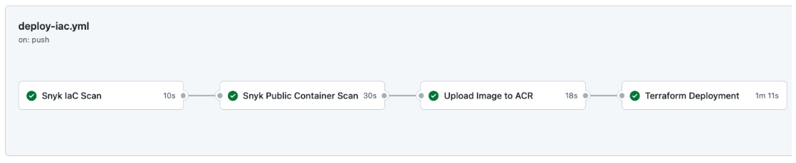

# CFP-Task

## Summary
A central CI/CD pipeline scans Terrafrom and container images for security vulnerabilities. If High or Critical issues are found, then the pipeline will terminate. Assuming no issues, a Postgres image is pulled from Docker Hub, tagged and automatically uploaded into a private Azure Container Registry (ACR). Finally, the image is pulled down from the ACR and deployed onto Azure Container Instances (ACI), along with a VNET / Subnet / Network Security Group (NSG). No further progress was made due to time restrictions.

## Tools Used
- Visual Studio Code (Free, Open Source, Many Plugins)
- Snyk (Supports scanning in IDE / Pipelines / Repo / Containers with good third party integrations and reporting).
- Github / Actions / Secrets (Industry standard version control, CI/CD and secure storage for sensitive info (e.g. API secrets)
- Terraform (Industry standard Infrastructure as Code language)
- Azure (I have more experience with Azure when compared with GCP / AWS)

## Assumptions
- You have an Azure tenancy with a subscription.
- You have a existing Azure Container registry configured with private networking (other registries would also work)
- You have Visual Studio Installed.

## Setup
1. Clone the repo locally.
2. Create a free Snyk account and generate an API token for your user account (https://snyk.io/).
3. Login to your Terraform Cloud account and generate an API token (https://app.terraform.io/app/).
4. Store both API tokens as Github Secrets with clear names (SNYK_API_TOKEN_DEMO / TF_API_TOKEN_DEMO).
5. Create an Azure Service Principal with Contributor permissions for the subscription: az ad sp create-for-rbac --name "<your-sp-name>" --role Contributor --scopes /subscriptions/<your-subscription-id>
6. Login to Terraform Cloud, create an API driven workspace and add the following PRIVATE workspace variables (ARM_CLIENT_ID, ARM_CLIENT_SECRET, ARM_SUBSCRIPTION_ID, ARM_TENANT_ID). Ensure the name of your ACR is also added (ARM_REGISTRY_NAME)
7.  Fill in the variables within the variables.tf file.
8.  Push to 'main' to start pipeline.
9.  Login to the Github portal to monitor progress / security results.